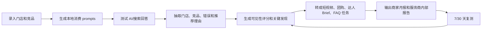

# 商业模式与 GTM 画布

更新时间：2026-05-19

## 一句话判断

这个项目早期不应按“独立 GEO SaaS”销售，而应作为抖音生活服务商的新增交付模块进入市场：

> 门店 AI 可见性体检 + 内容任务单 + 商家月报。

产品要服务服务商的销售、交付和续费，而不是只服务技术团队看排名。

## 目标客户

### 第一优先级

抖音生活服务运营商/服务商。

特征：

- 有 20 家以上本地商家客户。
- 服务餐饮、丽人、酒旅、亲子、休闲娱乐等到店场景。
- 交付内容包括短视频、直播、达人探店、团购组品、本地推、月报复盘。
- 有续费压力，需要新的服务卖点。

### 第二优先级

达人探店机构、本地推代理、到店营销服务商。

特征：

- 能影响门店内容和达人 Brief。
- 需要给商家解释为什么拍某些场景。
- 可能不愿意买完整工具，但愿意买报告或任务单。

### 暂不优先

- 单店老板自助购买。
- 只做课程培训的机构。
- 只做电商带货的 MCN。
- 全国品牌 SEO/GEO 团队。

## 客户痛点

| 痛点 | 当前表现 | 本产品对应价值 |
| --- | --- | --- |
| 签约缺新卖点 | 代运营服务同质化，商家觉得都差不多 | 用“AI 时代门店是否被正确推荐”做诊断钩子 |
| 月报难证明价值 | 商家只看 GMV/核销，过程价值难讲 | 输出竞品场景差距和下月任务 |
| 内容选题靠经验 | 短视频和达人 Brief 容易泛化 | 从高意图消费问题反推内容任务 |
| 续费压力大 | 商家看不到下月为什么继续做 | 每月复测同一组 prompts，形成持续复盘 |
| AI 概念难转化 | GEO 术语太抽象 | 改成“用户问 AI/搜索时有没有推荐你的店” |

## 产品服务包

### 试点包

对象：愿意尝试的服务商。

内容：

- 5-10 家门店。
- 每店 20 个 prompts。
- 3 个 AI 入口。
- 1 份门店体检报告。
- 1 份下月内容/团购/达人任务单。

目的：

- 验证报告能否进入签约、月报或续费。
- 验证单店报告生成成本。

### 服务商月报包

对象：已有稳定客户的服务商。

内容：

- 每月固定复测。
- 多门店批量报告。
- 白标商家月报。
- 任务单和素材方向。

价值：

- 降低月报成本。
- 增加续费理由。
- 形成可复制服务包。

### 销售诊断包

对象：服务商销售团队。

内容：

- 对潜在商家做签约前体检。
- 展示“你在哪些本地消费问题里输给竞品”。
- 输出 30 天优化计划。

价值：

- 提高签约转化。
- 增强服务商差异化。

## 产品闭环

## 流量来源假设

### 1. 服务商外联

动作：

- 用 [templates/lead_tracker.csv](./templates/lead_tracker.csv) 找 12 条线索。
- 先约访高分服务商。
- 免费跑 1 家门店样例换取反馈。

优点：

- 最快验证真实需求。
- 可以直接拿到门店数据。

风险：

- 依赖人脉和冷启动外联。
- 反馈样本小。

### 2. 内容获客

内容主题：

- “AI 会推荐你的门店，还是推荐竞品？”
- “抖音本地生活服务商如何用 AI 做月报？”
- “餐饮店在豆包/DeepSeek/Kimi 里的可见性测试”
- “服务商新增服务包：AI 可见性体检”

渠道：

- 公众号
- 小红书
- 抖音
- 即刻/知识星球/行业社群
- 服务商微信群

优点：

- 有教育市场的作用。
- 能沉淀案例。

风险：

- 转化慢。
- 容易吸引泛 AI 兴趣用户，而不是服务商买家。

### 3. 行业社群和合作伙伴

对象：

- 抖音本地生活服务商社群。
- 餐饮/酒旅/丽人服务商社群。
- 达人探店机构。
- 本地推代理。

动作：

- 拿真实门店样例做分享。
- 给服务商提供免费首店体检。

优点：

- 买家更集中。

风险：

- 需要信任背书。

### 4. 工具免费版

入口：

- Prompt Builder
- Answer Scorer
- 免费报告模板

转化：

- 免费工具吸引服务商试跑。
- 如果他们要批量门店、白标、复测和自动报告，再进入付费。

优点：

- 低成本获取早期用户。

风险：

- 免费用户不一定有付费意愿。

## 销售路径

### 阶段 1：问题教育

话术：

> 现在用户不只在抖音搜，也会问 AI：“附近哪家店适合约会/生日/亲子？”如果 AI 推荐竞品，或者说错商家的价格和特色，服务商需要知道。

目标：

- 让服务商理解问题。
- 不讲复杂 GEO。

### 阶段 2：样例诊断

动作：

- 免费为服务商的 1 家门店跑样例。
- 展示竞品占位、信息错误和内容缺口。

目标：

- 让服务商看到可讲给商家的东西。

### 阶段 3：服务包试点

动作：

- 5-10 家门店试点。
- 每店出报告和任务单。
- 服务商试着给商家讲。

目标：

- 验证是否能签约/续费/月报。

### 阶段 4：批量月报

动作：

- 多门店管理。
- 白标导出。
- 每月复测。

目标：

- 进入服务商固定交付流程。

## 定价假设

### 试点定价

- 免费首店样例。
- 5-10 家门店试点：¥999-1999。
- 目的不是赚钱，而是验证付费意愿。

### 服务商版

- 20 家门店以内：¥999-1999/月。
- 100 家门店以内：¥3999-8999/月。
- 定制版：按门店数、行业模板、白标和复测频率报价。

### 报告代工版

如果工具还没自动化，可以先卖报告代工：

- 单店报告：¥199-499。
- 10 店批量：¥1999-3999。

用途：

- 验证服务商是否愿意为结果付费。
- 先不急着开发完整 SaaS。

## 销售材料

必须准备：

- 1 份真实门店报告。
- 1 个工作台原型：[prototype/store-ai-visibility.html](./prototype/store-ai-visibility.html)
- 1 个服务商话术：[08_service_provider_outreach_and_sales_test.md](./08_service_provider_outreach_and_sales_test.md)
- 1 个 3 天试点流程：[18_pilot_runbook.md](./18_pilot_runbook.md)

暂不需要：

- 完整官网。
- 正式品牌视觉。
- 复杂定价页。
- 大规模自动化演示。

## 商业风险

| 风险 | 早期验证方式 |
| --- | --- |
| 服务商觉得商家听不懂 | 让服务商复述给商家听 |
| 服务商觉得和成交无关 | 看是否能转成短视频/团购/达人任务 |
| 只是一份新奇报告 | 看是否愿意每月复测和续费 |
| 成本太高 | 记录单店报告生成耗时 |
| 自动化受限 | 先半自动，不依赖平台接口 |

## 进入 v1 的条件

满足以下条件，再开发半自动 Web 工具：

1. 5 个服务商访谈中，至少 2 个愿意提供真实门店。
2. 至少 1 个服务商愿意拿报告给商家试讲。
3. 至少 1 个服务商愿意付费或明确说出可接受价格。
4. 真实门店测试中，至少 30% prompts 能形成明确诊断或任务。
5. 单店报告生成时间低于 90 分钟。

## 当前建议

先不要做完整商业化销售。

下一步只做一个小实验：

1. 用真实门店做一份报告。
2. 找 2 个服务商看。
3. 问他们是否愿意把它作为服务包的一部分卖给商家。

如果他们愿意，GTM 才成立；如果他们只觉得有趣但不愿试讲，产品应转向更直接的内容/达人/月报工具。
